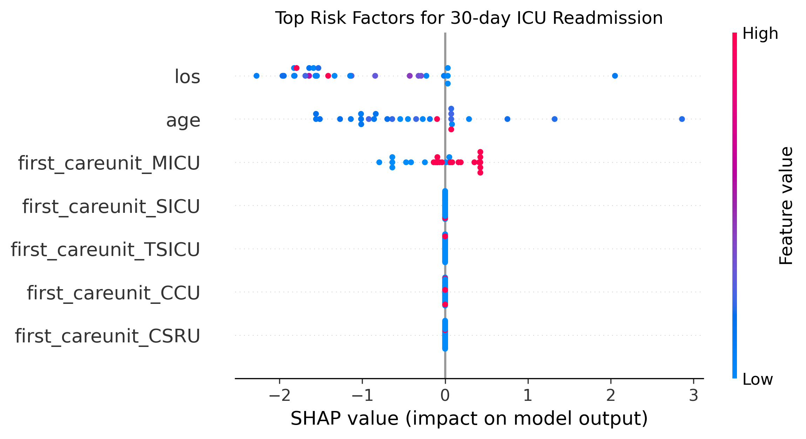

# ICU 30-day Readmission Risk Prediction  
**XGBoost + SHAP | MIMIC-III Demo | AUC = 0.4133**

20-year-old 4th-year Clinical Medicine Student │ China │ Nov 2025

## Key Findings
- ICU length of stay (los) is the strongest predictor
- Age is the second most important factor
- MICU patients have higher readmission risk

## Results

## Next Steps
- Full MIMIC-III dataset
- Web deployment (Streamlit)
- Applying to Health Informatics Master's in Canada

Contact: GitHub @你的用户名